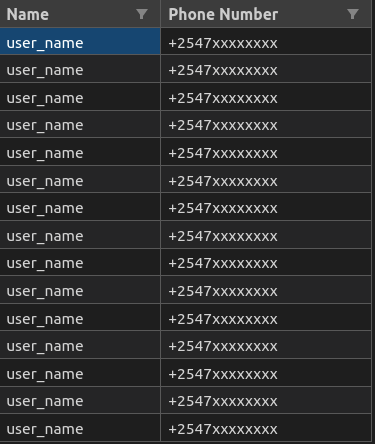
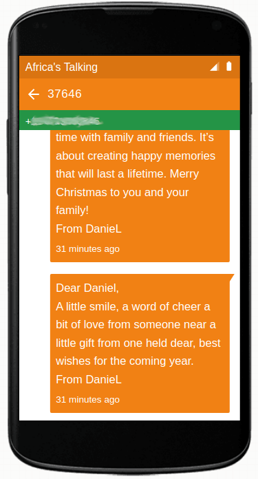
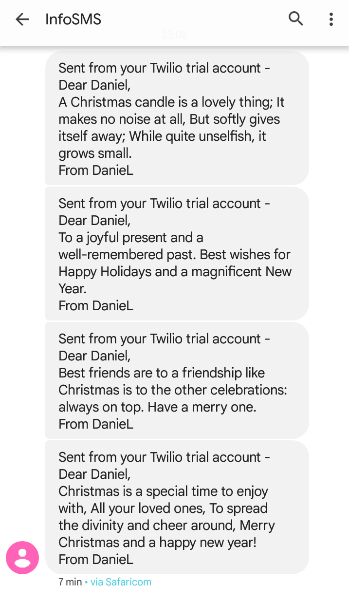

<h1 align="center">
    <b>CRINGEMAS</b>
</h1>

## Introduction
The goal is very simple automate sending those cringe christmas and new years chain messages to everyone in my family. The implementation is quite simple a python script that consumes a [christmans messages api](https://github.com/babatundelmd/Christmas-Messages-Api) and sends random messages to all contacts in a csv file. Why? oh well!

## Prerequisites
[Python 3.7](https://www.python.org/downloads/)

## Running Locally
### Clone the repository
```bash
git clone git@github.com:DanNduati/Cringemas.git
```
### Create a python virtual environment activate it
```bash
python3 -m venv venv
```
```bash
source venv/bin/activate
```
### Create a `.env` file similar to [`.env.example`](https://github.com/DanNduati/Cringemas/blob/main/cringemas.py) and add all your twilio and Africas talking creds to it

### Create a csv file similar to [fam.copy.csv](https://github.com/DanNduati/Cringemas/blob/main/fam.copy.csv)



### Install dependencies
```bash
pip install -r requirements.txt
```
Run the script with:
```bash
python cringemas.py
```
----

Used this project to benchmark both [Twilio](https://www.twilio.com/docs/sms/quickstart/python#send-an-outbound-sms-with-python) and [Africas Talking](https://developers.africastalking.com/docs/sms/overview) SMS Api's.

## Outcome
<center>

| </img> 	| </img> 	|
|:----------------------------------------------:	|:----------------------------------------------:	|

</center>

----

<p align="center">
    </img>
</p>
